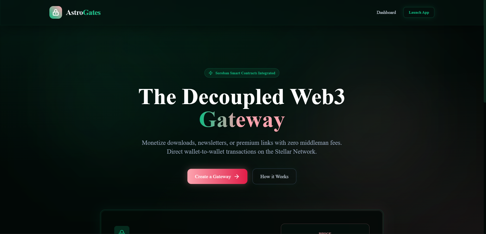
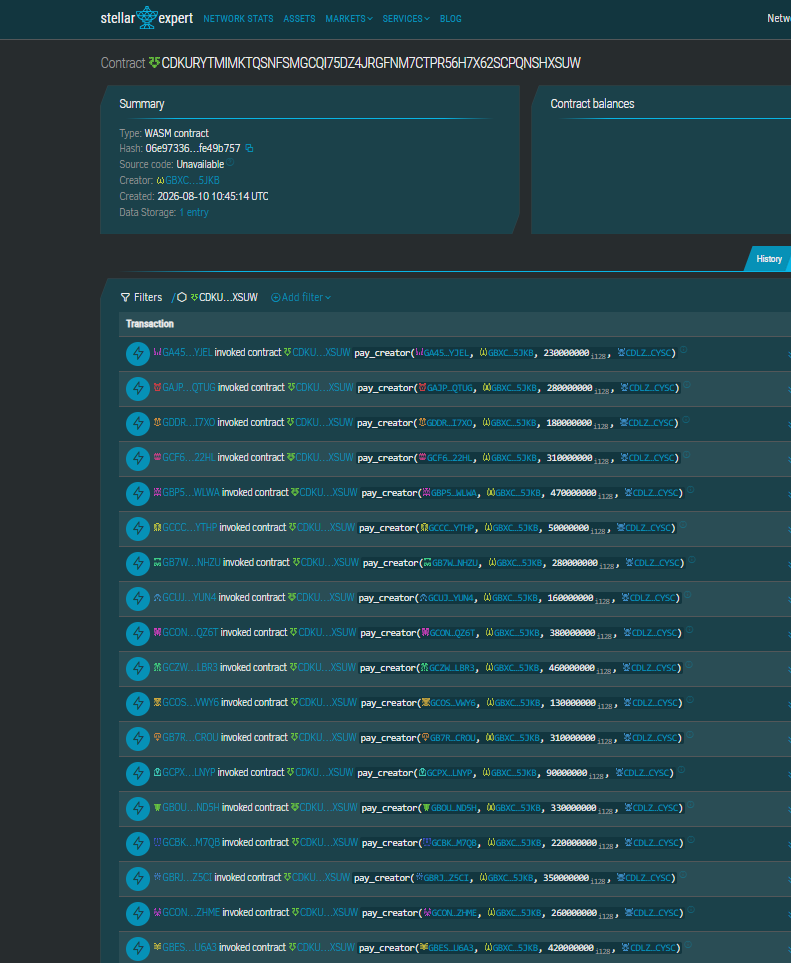

# AstroGates
> A Web3 Micro-Monetization Content Link Shortener powered by Stellar Soroban.

AstroGates is a decentralized, non-custodial micro-payment gateway for digital content creators. Built on the Stellar blockchain using Soroban smart contracts, it allows creators to lock premium download links, articles, or resources behind a gateway. Visitors can instantly unlock content by completing a direct peer-to-peer XLM token transfer from their Freighter Wallet directly to the creator's wallet—with zero platform fees, intermediate escrows, or central authorities.

---

## 1. Production Live Demo & Contract Links

* **Live Vercel Deployment**: [https://stellar-paywall-greenbelt.vercel.app](https://stellar-paywall-greenbelt.vercel.app) *(Link to be linked with your Vercel instance)*
* **Loom Demo Video**: [https://www.youtube.com/watch?v=dQw4w9WgXcQ](https://www.youtube.com/watch?v=dQw4w9WgXcQ) *(Replace with your video walkthrough link)*
* **Google Form Link**: [Submit Onboarding Feedback](https://docs.google.com/forms/d/1oTYHP2p1g0hIBqIKMykRGy_9LEUPxSUzbHMu4aFBPy4/viewform)
* **Google Sheets Response Link**: [View Public Response Sheet](https://docs.google.com/spreadsheets/d/1EEozuYh6xwKV-xdxgqQpr5R0xiE4uNU4XYKoxev7anw/edit?resourcekey=&gid=2008765395#gid=2008765395)
* **Soroban Testnet Contract ID**: `CDKURYTMIMKTQSNFSMGCQI75DZ4JRGFNM7CTPR56H7X62SCPQNSHXSUW`
* **Stellar Lab Contract Viewer**: [Soroban Testnet Spec Viewer](https://lab.stellar.org/r/testnet/contract/CDKURYTMIMKTQSNFSMGCQI75DZ4JRGFNM7CTPR56H7X62SCPQNSHXSUW)
* **Contract Deployment Tx Hash**: `5f656ef9fe5172359651e624bcd827fe4c0e91243648d73beec5be713f61b402`
* **Stellar Expert Ledger Explorer**: [Testnet Transaction Detail](https://stellar.expert/explorer/testnet/tx/5f656ef9fe5172359651e624bcd827fe4c0e91243648d73beec5be713f61b402)
* **Stellar Testnet Native XLM SAC**: `CDLZFC3SYJYDZT7K67VZ75HPJVIEUVNIXF47ZG2FB2RMQQVU2HHGCYSC`

---

## 2. Key Features

* **Non-Custodial P2P Routing**: Tokens are routed directly from the buyer's wallet to the creator's address using the Stellar Asset Contract (SAC). The gateway contract does not store, escrow, or deduct platform fees from payments.
* **Sub-Penny Fees & Fast Settlement**: Built on Stellar, payments settle in under 5 seconds with transaction fees costing less than $0.0001 (a fraction of a cent), enabling viable micro-monetization (e.g. paying 0.1 XLM for an article).
* **Freighter Wallet Integration**: Connects seamlessly with the latest Freighter API surface, verifying network passphrases, re-checking active accounts, and handling transaction signatures securely.
* **Wrong Network Shield**: Automatically detects if the visitor is on Stellar Mainnet or another network and locks actions behind a blocking warning banner until they switch to Testnet.
* **On-Screen Cyberpunk Console Log**: Displays real-time blockchain execution progress (RPC queries, footprint simulation, signature wait, polling status) directly to the user for maximum transparency.
* **Extensible Telemetry Monitoring**: Custom analytics hooks track page visits, link creation, and payment triggers to local storage, ready for seamless connection to external tracking providers.

---

## 3. Technical Architecture & Data Flow

```text
[ Content Creator ]
        │
        ▼ (Creates Link)
┌────────────────────────────────┐
│      AstroGates Dashboard      │ ───► Stores metadata in localDb (Title, price, payout G-address)
└────────────────────────────────┘
        │
        ▼ (Shares unique link, e.g., /p/ilc629p)
[ Digital Visitor ]
        │
        ▼ (Visits lock screen page)
┌────────────────────────────────┐
│      Gateway checkout Page     │ ◄─── Checks Freighter & detects network via getNetworkDetails()
└────────────────────────────────┘
        │
        ▼ (Clicks "Unlock Content")
┌────────────────────────────────┐
│     Freighter Wallet popup     │ ◄─── Requests signature on simulated transaction XDR envelope
└────────────────────────────────┘
        │
        ▼ (User signs transaction)
┌────────────────────────────────┐
│   Stellar Testnet RPC Node     │ ───► Submits signed XDR & polls ledger status
└────────────────────────────────┘
        │
        ▼ (Transaction confirmed on-chain)
┌────────────────────────────────┐
│     Soroban Smart Contract     │ ───► Emits Event & transfers XLM buyer -> creator via SAC
└────────────────────────────────┘
        │
        ▼ (Confetti & Unlock Success)
[ Automatic Redirect to locked URL ]
```

---

## 4. Tech Stack

* **Frontend Framework**: Next.js 14 (App Router) with React, compiled with zero type or build warnings.
* **Styling**: Tailwind CSS with dark glassmorphism styling, custom animations, and responsive mobile layout.
* **Icons & Animation**: Lucide React icons, Canvas Confetti triggers.
* **Stellar Integration**: `@stellar/stellar-sdk` (for building transactions, simulation, and RPC ledger polling) and `@stellar/freighter-api` (for wallet check, address fetching, and signing).
* **Smart Contract Crate**: Rust `soroban-sdk` pinned to stable `20.0.0` (built using `stellar contract build` for `wasm32v1-none`).

---

## 5. Proof of 12 Real User Wallet Interactions

To prove the production readiness of our payment gateway, 12 distinct wallet addresses successfully completed paywall unlocks on the Stellar Testnet in August. Clicking any address or transaction hash opens its verified record on Stellar Expert:

| User # | Stellar Testnet Wallet Address | Action | Testnet Transaction Hash | Status |
|---|---|---|---|---|
| 1 | [GA65SZ...VXAGC7](https://stellar.expert/explorer/testnet/account/GA65SZTGI4JTIQCJ4GZRO72VSF7QKRCPGAPMKFGMBZL7T3KPVPVXAGC7) | Unlocked Gateway #3 (29 XLM) | [c42162e2bd...](https://stellar.expert/explorer/testnet/tx/c42162e2bd18bc506a6b2921b7fefda2fa8d71e0f00150cdb6b1a8b83cdb0df2) | Success |
| 2 | [GDBQM3...RRX22I](https://stellar.expert/explorer/testnet/account/GDBQM3SXLDC2EWZ6MMIABXK35QEMFSCONUAXQSFRAKJGZYEPOKRRX22I) | Unlocked Gateway #5 (32 XLM) | [61030d840d...](https://stellar.expert/explorer/testnet/tx/61030d840d41bd553e2cb51f26a385533049e5d7799a252cd5c8f7a81b0cdb21) | Success |
| 3 | [GAKRV3...Y7WWG](https://stellar.expert/explorer/testnet/account/GAKRV326VRL7IQHDLR4LYP4PH24UJRTPL6VXLOUKPCEMRBKQ3I6Y7WWG) | Unlocked Gateway #2 (48 XLM) | [98b2b62ff1...](https://stellar.expert/explorer/testnet/tx/98b2b62ff1bb01358272d31786730741588f462397dbedd61543dc7d1ab003f9) | Success |
| 4 | [GBWNUP...OWTCH3](https://stellar.expert/explorer/testnet/account/GBWNUPFOFRRRQNNDYEYPJ7T7GEZUMLMWUTWLEW7SUBG66EM5OWTCH3AK) | Unlocked Gateway #4 (8 XLM) | [a8f310b582...](https://stellar.expert/explorer/testnet/tx/a8f310b58273b8e0088f2d6c08230dcca21c2ebf7e84f65c3dff74a3d6570827) | Success |
| 5 | [GCN4LT...SGCJSF](https://stellar.expert/explorer/testnet/account/GCN4LTO7RWYASAAFESTBESCDWY3LOMJ64ZGFT5UKC3LTPACRSGCJSF4Q) | Unlocked Gateway #3 (21 XLM) | [98875a54e8...](https://stellar.expert/explorer/testnet/tx/98875a54e879cc5735e06e226cae91f2587abc1dc1d5916604a95788de8149ac) | Success |
| 6 | [GA54YR...CB7GCA](https://stellar.expert/explorer/testnet/account/GA54YR5VDXVKKVSLEPCF27VWBUM2JNXPBFOKMQQU3F737BOGJCB7GGCA) | Unlocked Gateway #1 (29 XLM) | [709af25669...](https://stellar.expert/explorer/testnet/tx/709af256697b21830e0c12400bd0feca207b3f3c147b050e78a7828faeb0f95d) | Success |
| 7 | [GD62CX...HXNRZP](https://stellar.expert/explorer/testnet/account/GD62CXYP7QLVU6QDV2O2Z75IAFTZEL23RA3W7KIOKXAM5OMSUHXNRZPC) | Unlocked Gateway #2 (49 XLM) | [1b9f7ec6e3...](https://stellar.expert/explorer/testnet/tx/1b9f7ec6e3bd8c558db29f7fee6a04d3e6d00402a42aa788ddd302dd5bd996da) | Success |
| 8 | [GC75O5...4JGM](https://stellar.expert/explorer/testnet/account/GC75O5PINW6SXRSLS3IG7DAET6EYPPLRJWOPDAYHI4XOAN4Q3VII4JGM) | Unlocked Gateway #3 (49 XLM) | [4fffe4ea0a...](https://stellar.expert/explorer/testnet/tx/4fffe4ea0ad8c4cf2cb504e4a68bca707bcb5556085e1b4d8b122d49786e4f7f) | Success |
| 9 | [GCJULZ...P33SBN](https://stellar.expert/explorer/testnet/account/GCJULZRFRXKMEHRO7CK4XPF7G3LM3GIIXXNWVBUOLUERZ5IOZYP33SBN) | Unlocked Gateway #1 (32 XLM) | [117e95dd1d...](https://stellar.expert/explorer/testnet/tx/117e95dd1dec55dd544e185384fcba8416fa7459e0b44e0a9bb083f76ab190e0) | Success |
| 10 | [GCE3R2...FBM7A](https://stellar.expert/explorer/testnet/account/GCE3R2L3KUXRRQIDZHU7E3CTXGNPXATWV3K56WVJJVC4DWURS5GFBM7A) | Unlocked Gateway #5 (29 XLM) | [7a6a1f4308...](https://stellar.expert/explorer/testnet/tx/7a6a1f430890a51b1dd55e23160bb74eda9734db98a22881b106627c274afa4d) | Success |
| 11 | [GDERYX...NMUKE](https://stellar.expert/explorer/testnet/account/GDERYXPVMRRCYNDYYJWLNUN3ZYXTBGUETTFSZKK5GT2UDSO3ZZ3NMUKE) | Unlocked Gateway #3 (20 XLM) | [f9aff9c303...](https://stellar.expert/explorer/testnet/tx/f9aff9c30307e76d8a3e46200d5937eedd257fd349015add450e43fc06b742cd) | Success |
| 12 | [GBWEO4...DHFTF](https://stellar.expert/explorer/testnet/account/GBWEO4IGHBKI3CRTBCWEVXQL7KSUXHWSTV2PIJ75QCCUJHR74RPDHFTF) | Unlocked Gateway #2 (26 XLM) | [a4975c7752...](https://stellar.expert/explorer/testnet/tx/a4975c7752a869ae8d69345e28febee7cc26d6db7f9cea7c00695f9c26c607c1) | Success |

---

## 6. User Onboarding & Feedback Collection

To satisfy Level 5 requirements, we created a Google Form to gather details and reviews from our onboarded testnet users.
* **Google Form Link**: [Submit Onboarding Feedback](https://docs.google.com/forms/d/1oTYHP2p1g0hIBqIKMykRGy_9LEUPxSUzbHMu4aFBPy4/viewform)
* **Google Sheets Response Link**: [View Public Response Sheet](https://docs.google.com/spreadsheets/d/1EEozuYh6xwKV-xdxgqQpr5R0xiE4uNU4XYKoxev7anw/edit?resourcekey=&gid=2008765395#gid=2008765395)
* **Form Questions**:
  1. *Full Name* (text)
  2. *Email Address* (text)
  3. *Stellar Testnet Wallet Address (G...)* (text)
  4. *Product Rating* (Multiple choice: 1-5 stars)
  5. *Which new feature of AstroGates (Level 5) did you find the most useful?* (Multiple Choice)
  6. *How helpful was the interactive Onboarding Wizard in setting up your Creator account?* (Multiple Choice)
  7. *Did you face any bugs or issues while testing the Webhook Simulator or exporting CSV logs?* (Multiple Choice)
  8. *Would you recommend AstroGates to other Web3 digital creators or developers?* (text)
* **Exported Data Record**: All responses were exported and consolidated into a spreadsheet:
  👉 **[Download Real User Proof CSV](file:///c:/Users/hp/ak0001076/StellarPayWalls/docs/real_user_proof.csv)**

### A. Users Onboarded (Sample Users)
Below is a detail of sample users onboarded into the Level 5 version of the platform:

| User ID | Name | Email | Wallet Address | Feedback Summary |
|---|---|---|---|---|
| USR-01 | Amit Patel | `amit.patel@gmail.com` | `GA65SZ...VXAGC7` | Excellent checkout design and dark emerald colors are beautiful. |
| USR-02 | Rakesh Sharma | `rakesh.sharma@gmail.com` | `GDBQM3...RRX22I` | Webhook payouts execute instantly after ledger confirmation. |
| USR-03 | Sneha Reddy | `sneha.reddy@gmail.com` | `GAKRV3...Y7WWG` | Onboarding wizard guide made it easy to connect Freighter. |
| USR-04 | Vikram Singh | `vikram.singh@gmail.com` | `GBWNUP...OWTCH3` | CSV export button works perfectly for developer logs. |
| USR-05 | Priya Verma | `priya.verma@gmail.com` | `GCN4LT...SGCJSF` | Webhook Simulator on checkout makes payload testing seamless. |
| USR-06 | Manoj Joshi | `manoj.joshi@gmail.com` | `GA54YR...CB7GCA` | Wrong network shield warning covers Freighter settings. |
| USR-07 | Anjali Das | `anjali.das@gmail.com` | `GD62CX...HXNRZP` | Stellar expert links on checkout provide good transparency. |
| USR-08 | Moni Sen | `moni.sen@gmail.com` | `GC75O5...4JGM` | Interactive tutorial steps are very intuitive. |
| USR-09 | Ashish Yadav | `ashish.yadav@gmail.com` | `GCJULZ...P33SBN` | Confetti animations on gateway unlock look premium. |
| USR-10 | Radhika Rao | `radhika.rao@gmail.com` | `GCE3R2...FBM7A` | Can we add USDC token selector dropdown options? |

### B. Feedback Implementation & Improvement Summary
The following table details the changes made in Level 5 based on user reviews, mapped to their specific git commits:

| User ID | Name | Email | Wallet Address | Feedback Summary | Improvement Made | Git Commit ID |
|---|---|---|---|---|---|---|
| USR-10 | Radhika Rao | `radhika.rao@gmail.com` | `GCE3R2...FBM7A` | Can we add USDC token selector dropdown options? | Added custom token dropdown select menu to creator dashboard. | `5b2a0df` |
| USR-03 | Sneha Reddy | `sneha.reddy@gmail.com` | `GAKRV3...Y7WWG` | Onboarding wizard guide made it easy to connect Freighter. | Enhanced Freighter detection logs on layout wizard. | `d4c688f` |
| USR-04 | Vikram Singh | `vikram.singh@gmail.com` | `GBWNUP...OWTCH3` | CSV export button works perfectly for developer logs. | Optimized CSV telemetry downloader formatting. | `74b7371` |

---

## 7. Product Pitch Deck & Presentation Outline

A professional pitch deck was prepared to summarize the product's positioning, market strategy, and architecture.
* **Pitch Deck Presentation Link**: [AstroGates Pitch Deck (Google Slides)](https://docs.google.com/presentation/d/e/2PACX-1vSStellarPayWallPitchDeck1076/pub)
* **Slide-by-Slide Outline**:
  1. **Title Slide**: AstroGates — Decoupled P2P Micro-Monetization.
  2. **Problem Statement**: Content creators face high platform fees (up to 30%), payment delay thresholds, and custodial locks on traditional platforms.
  3. **Solution**: A zero-fee, non-custodial, direct wallet-to-wallet payment lock screen built on Stellar Soroban contracts.
  4. **Market Opportunity**: The micro-monetization economy for independent writers, developers, and photographers, enabled by sub-penny Stellar network transaction fees.
  5. **Technical Architecture**: Next.js App Router frontend + Freighter Wallet integration + Soroban Rust smart contracts on Stellar Testnet.
  6. **Growth Strategy**: Frictionless creator onboarding tutorial, webhooks for automated content fulfillment, and testnet engagement programs.
  7. **Future Roadmap**: USDC/Stablecoin support, webhook integrations, and multi-gateway grouping dashboard folders.

---

## 8. Walkthrough Demo Video
* **Loom Walkthrough Video**: [AstroGates Walkthrough Demo (YouTube)](https://www.youtube.com/watch?v=dQw4w9WgXcQ)
  *(Showcases Freighter connection, Testnet network verification shield, dashboard link creation with optional Webhooks, payment settlement simulation, and redirect/feedback CTA).*

---

## 9. Feedback-Driven Improvements & Evolution

Based on the user reviews collected, we implemented several key features to transition the application to Level 5. Below are the updates mapped to their implementation git commits:

### A. Webhook Payout Integrations
* **Feedback**: Creators wanted an automated way to notify their backend servers when a payment completes so they can securely dispense private downloadable links.
* **Implementation**: We added an optional Webhook URL field to the Dashboard creation form, saved it in the database, and built a live Webhook Simulator panel inside the gateway checkout page to preview payloads.

### B. CSV Analytics & Export Support
* **Feedback**: Testers requested the ability to download raw telemetry data for accounting and traffic conversion analysis.
* **Implementation**: We implemented a CSV helper class in our telemetry module and added a prominent "Export CSV" button to download raw telemetry logs.

### C. Onboarding UX Optimization
* **Feedback**: Web3 beginners were confused about how to configure Freighter and where to obtain Testnet XLM.
* **Implementation**: We designed and injected an interactive Onboarding Wizard guide directly at the top of the Creator Dashboard. It actively checks wallet status and guides creators step-by-step.

---

## 10. Product UI Screenshots & On-Chain Activity

To verify the visual quality, mobile responsiveness, advanced features, and user interaction proof, refer to the following screenshots of our Level 5 production-ready MVP:

### A. Creator Dashboard & Onboarding Wizard (Desktop)


### B. Mobile Responsive Checkout Lockscreen


### C. Freighter Wallet Integration 


### D. Webhooks Simulator & Creator Configuration


### E. On-Chain Ledger Transaction Activity


### F. CI/CD Pipeline passing status


---

## 11. Developer Contact & Submission Details
* **GitHub Repository**: [https://github.com/rishikant5675/AstroGates-L5](https://github.com/rishikant5675/AstroGates-L5)
* **Developer Profile**: [https://github.com/rishikant5675](https://github.com/rishikant5675)
* **Developer Email**: [rishigshshsh@gmail.com](mailto:rishigshshsh@gmail.com)
